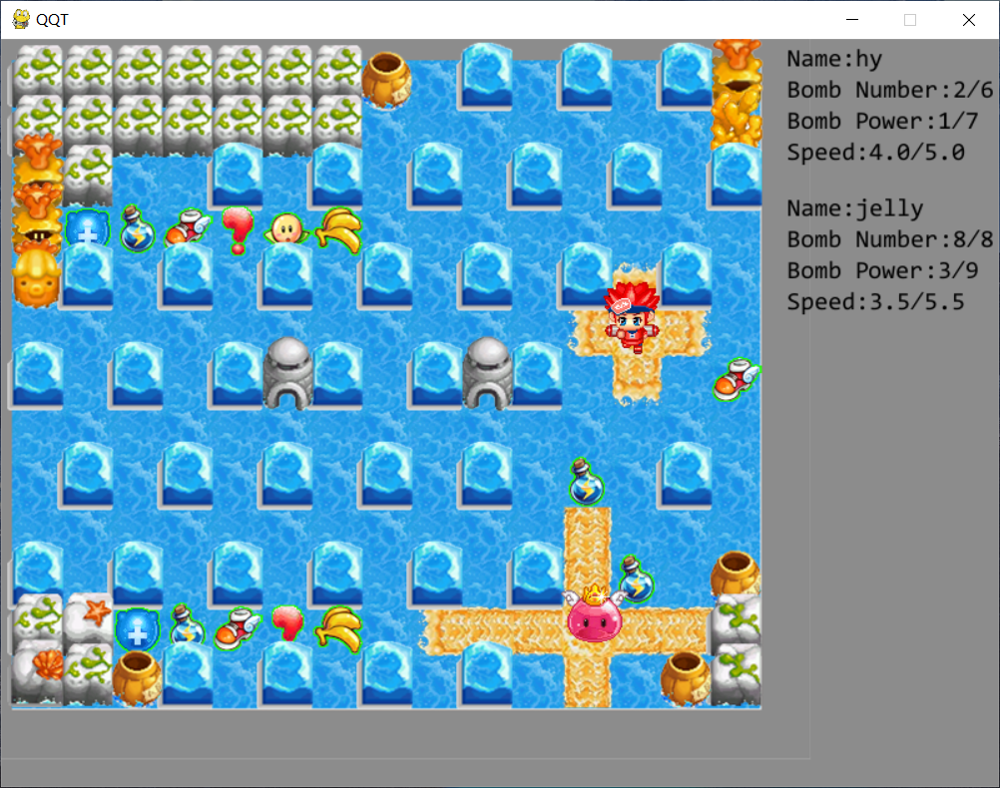
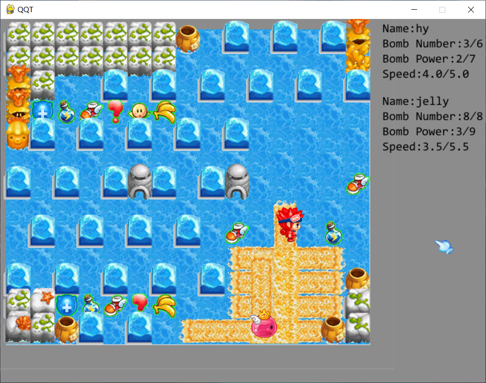

不更了不更了，实在没有精力和动力。现在虽然游戏素材都有了，但是没机会用了。

Pygame真的是开发、运行效率都极低。如果真要做个（接近）成品还是要换Unity之类的。

此外也有不少dalao在尝试做QQT了，完成度高的有两三个，可以在b站上找。

-----

想复刻一个QQ堂，练习Python。

准确来说复刻的不是QQ堂，只能是部分经典地图（如水面11，含水手）及模式。因为做不到。。以及pygame确实不适合做游戏。

## 前言
QQ堂素材比较少（名气不大还很老，所以去解包的人很少），所以几乎所有图片都来自视频/地图编辑器截图，并通过PS修正细节、裁剪、调整大小。

QQ堂很早前就已不再更新，因此不支持win10，需下载虚拟机安装XP玩，比较麻烦~~我比较懒~~，所以目前不能亲身体验QQ堂，制作细节主要凭感觉、视频素材以及同学帮助。

因为开始时刚接触Python一个月，代码实现、文件结构可能不是很好，如有建议还请指出。

开始于 2021.8.17。

## 游戏玩法
上下左右控制移动，空格放炸弹。

1 2 3 4 5 6可放置当前已有的道具。

目前人物是无敌的。

**运行方式：**

直接用`python3`运行`main.py`。

## 目前效果

- 可以较方便地自定义水面地图
- 基本道具
- 基本人物动画
- 基本泡泡爆炸实现

## 待解决问题

- 泡泡连锁爆炸的效率很低，导致动画有明显卡顿或bug（明明那DFS复杂度也不高，也已经花了不少时间）。可能主要还是Python和60帧的问题。
- 人物碰撞判定，目前使用的是当前中心所在格子，但应该是用一个方块。
- 调整一下地图元素视觉效果（等多学一点PS之后 ~~也就是咕咕了~~ ）
- 还有很多的todo，最想做的是水面11的水手（用探险那样的简单AI也就是只会贴贴）（但是没有水手素材，只有找到了正面行走gif，可能要去扣侧身和背身的图）、地图元素互动（比如水面11的洞，草丛）、人物残影（感觉就是保存前几帧或几秒的位置？）

以及

几乎所有图片要自己做，大小、图像输出的偏移量（精确到1像素），都要对比游戏原图调。要保证所有元素图片的每一条棱，与游戏中对应元素对齐。这内容多起来真的好麻烦。

所有图片都需要抠，每种类型的好多图片都要做一致的处理。如果有种类型的一点点参数不满意，要全部重改。

多线程（Timer）太迷惑了，效率到底高不高啊，不太敢用了。炸弹类写了很多效果还是不好。

